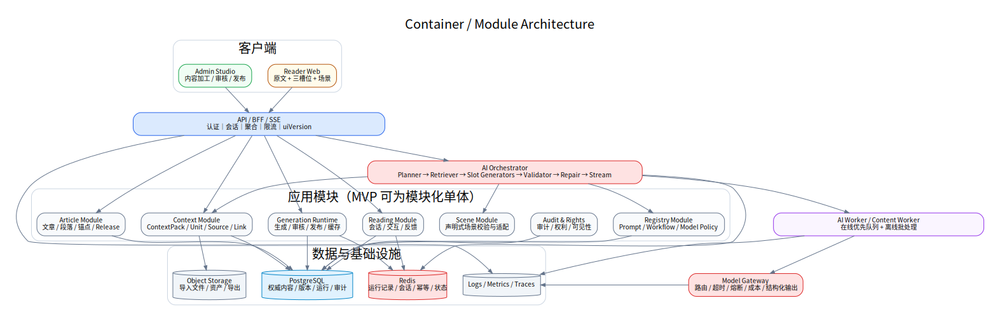

# 总体架构设计

版本：`1.1`

## 1. 架构目标

系统必须同时支持两条路径：

- **快路径**：用户滚动时，以流式运行记录和缓存提供稳定、低延迟的三槽位内容；
- **慢路径**：用户主动点击、选中或提问时，以 ContextPack、内置 Prompt 和 Workflow 进行定向生成与流式提交。

架构的核心不是“接一个大模型”，而是将正文、ContextPack、提示词、工作流、流式运行记录和运行记录分别版本化，并通过稳定的数据契约连接。

## 2. 总体架构图



```text
阅读端 / 内容工作台
        ↓
API / BFF / SSE
        ↓
文章服务 ─ ContextPack 服务 ─ 生成运行服务
        ↓                ↓
阅读会话服务      AI Orchestrator
                     ├─ Interaction Planner
                     ├─ Context Retriever
                     ├─ Slot Generators
                     ├─ Scene Planner
                     ├─ Validators / Repair
                     └─ Model Gateway
        ↓                ↓
PostgreSQL / PostGIS / pgvector / Redis / Object Storage
        ↓
Observability / Audit / Prompt & Workflow Registry
```

## 3. 关键架构决策

1. **PostgreSQL 为权威数据源**：文章、锚点、情境单元、链接、来源、运行记录、运行记录和版本均存入 PostgreSQL；需要地理能力时启用 PostGIS，需要语义检索时可用 pgvector。
2. **知识图谱是投影，不是第一阶段真相源**：关系可从规范表导出，避免过早引入独立图数据库。
3. **模型输出必须结构化**：所有规划、卡片和场景都通过 JSON Schema 验证。
4. **卡片级语义流**：不直接把未经校验的 Token 流给用户。
5. **流式运行记录不可变**：发布内容与实时动态结果分开存储。
6. **ContextPack 先于模型记忆**：具体事实不允许仅依赖模型内部知识。
7. **检索层执行时间过滤**：时间冻结不能只由 Prompt 自律。
8. **内容生产与阅读运行时分离**：编辑端允许重计算，阅读端只读取已发布版本和受控动态结果。
9. **模型网关隔离供应商**：上层只使用统一任务协议。
10. **每次生成可重放**：记录输入哈希、来源 ID、Prompt、Workflow、模型、参数和输出。

## 4. 服务边界

| 服务 | 主要职责 | 不负责 |
|---|---|---|
| Article Service | 文章、段落、锚点和元数据 | AI 生成 |
| Context Service | ContextPack、ContextUnit、实体、来源和链接 | 前端渲染 |
| Generation Runtime | 离线生成、审核、发布、读取与缓存预热 | 处理自由问答 |
| Reading Session Service | 会话、当前锚点、模式、交互状态和反馈 | 历史内容判断 |
| AI Orchestrator | 规划、检索、生成、校验、修复、流式提交 | 保存规范正文 |
| Scene Service | 校验场景数据并转换为前端可渲染模型 | 让模型直接画 SVG |
| Model Gateway | 模型路由、超时、重试、成本、追踪 | 决定业务语义 |
| Prompt Registry | Prompt 版本、变量、输出 Schema、发布状态 | 管理文章资料 |
| Workflow Registry | 工作流版本、节点、分支、超时和回退 | 执行 UI |
| Admin Studio API | 内容生产、审核和发布 | 面向公众阅读 |

MVP 可在一个后端代码库中以模块化单体实现，但必须保持上述领域边界，以便后续拆分。

## 5. 运行时路径

### 5.1 快路径

```text
AnchorObserver
→ GET Published GenerationRun
→ Redis 命中
→ 返回完整 GenerationRunPayload
→ Client diff
→ 更新必要槽位
→ 预取相邻锚点
```

### 5.2 慢路径

```text
Interaction Event
→ Normalize / Authorize / Deduplicate
→ Planner
→ Context Retrieval
→ Prompt Assembly
→ Parallel Slot Generation
→ Deterministic Validation
→ Semantic Validation
→ Optional Repair
→ SSE Commit
→ Persist GenerationRun
→ Dynamic Cache
```

## 6. 数据层

- **PostgreSQL**：权威内容、版本、运行和审计；
- **PostGIS**：地点、路线和区域；
- **pgvector**：锚点和情境单元语义召回；
- **Redis**：流式运行记录缓存、会话、幂等、任务状态和限流；
- **对象存储**：导入文件、图片、地图底图、导出包和可选扫描页；
- **日志/追踪系统**：服务、模型调用和质量指标。

全文检索可先使用 PostgreSQL `tsvector`，数据量与搜索需求增加后再迁移到专用搜索服务。

## 7. 一致性与版本

发布读取组合：

```text
ArticleRelease
  = articleVersion
  + contextPackVersion
  + promptBundleVersion
  + workflowVersion
  + generationRunSetVersion
```

阅读会话始终绑定一个 `releaseId`。新版本发布后，已有会话可继续使用旧版本到刷新或显式切换，避免阅读中途内容改变。

## 8. 缓存

### 流式运行记录缓存键

```text
generation_run:{releaseId}:{anchorId}:{mode}
```

### 动态结果缓存键

```text
dynamic:{releaseId}:{anchorId}:{mode}:{eventType}:{selectionHash}:{entityId}:{questionHash}
```

动态缓存 TTL 可短，流式运行记录缓存随版本失效。缓存不可成为唯一存储。

## 9. 安全与质量边界

- 选中文本、用户问题和导入资料都作为不可信输入；
- 用户文本必须放入数据分隔区，禁止进入系统 Prompt；
- 模型只能引用本次检索返回的 source IDs；
- 场景坐标、日期和关系只能从已审核 ContextPack 选择；
- 后台发布需要双角色审核；
- 所有 Prompt/Workflow 变更要有审计和回滚；
- 权利不清的资料可设为仅内部可见。

## 10. 部署

MVP 可采用：

```text
CDN/WAF
  → Web Frontend
  → API/BFF
      ├─ Application API
      ├─ AI Worker
      └─ Content Worker
  → PostgreSQL / Redis / Object Storage
  → External or Self-hosted Model Gateway
  → Logs / Metrics / Traces
```

开发环境可用 Docker Compose，生产环境可用容器平台或 Kubernetes。首期优先保证可观测、备份和回滚，不急于拆微服务。

## 11. 故障降级

- 模型不可用：已流式运行记录继续服务；
- Redis 不可用：回源 PostgreSQL，降低性能但不丢内容；
- 场景服务失败：文字卡片继续；
- 单卡失败：其他卡正常；
- 校验服务失败：不提交动态内容，回退运行记录；
- 新版本发布失败：保持旧发布指针；
- SSE 失败：使用轮询查询交互最终状态。

详细设计见 `docs/04_SYSTEM_ARCHITECTURE.md`。

