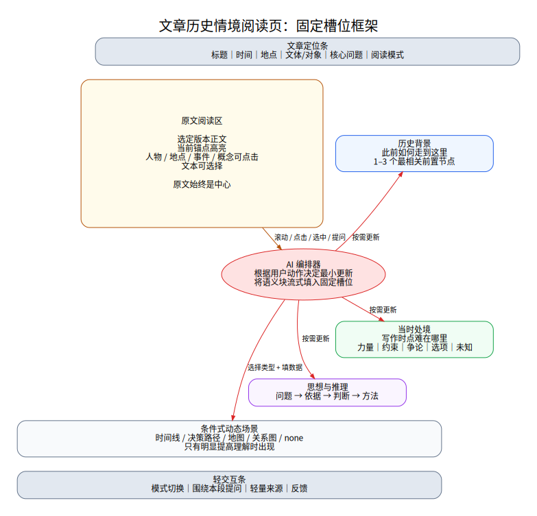

# 02. 信息架构与界面槽位规范

## 2.1 设计目标

界面必须同时满足两件事：

- 原文阅读不被打断；
- 历史背景、当时处境和思想推理能在用户需要时及时出现。

不采用多层复杂仪表盘，也不将聊天框设为主入口。主页面只保留一个阅读主轴、三个固定解释槽位和一个条件式场景区域。

## 2.2 桌面端框架



```text
┌────────────────────────────────────────────┐
│ 文章定位条：标题 / 时间 / 地点 / 文体 / 核心问题 │
├──────────────────────┬─────────────────────┤
│                      │ [历史背景]          │
│                      │ 此前如何走到这里    │
│      原文阅读区       ├─────────────────────┤
│                      │ [当时处境]          │
│ 当前锚点高亮          │ 此刻难在哪里        │
│ 可点击实体 / 可选文本 ├─────────────────────┤
│                      │ [思想与推理]        │
│                      │ 如何判断与行动      │
├──────────────────────┴─────────────────────┤
│ 条件式场景：时间线 / 决策路径 / 地图 / 关系图 │
├────────────────────────────────────────────┤
│ 轻交互条：模式 / 围绕本段提问 / 反馈 / 来源 │
└────────────────────────────────────────────┘
```

推荐宽屏比例：原文区 60%–66%，情境侧栏 34%–40%。场景区域默认折叠或维持 240–360px 高度。

## 2.3 页面区域

### A. 文章定位条

固定显示：

- 标题；
- 写作日期或时间范围；
- 地点；
- 文体与主要对象；
- 文章要解决的核心问题；
- 当前阅读模式。

可展开显示：文章简介、情境包版本、选定版本说明。

### B. 原文阅读区

职责：

- 展示选定版本正文；
- 维护段落 ID 和锚点边界；
- 高亮当前锚点与用户选区；
- 对人物、地点、事件、概念提供低干扰点击标记；
- 支持字号、行距和列宽调整；
- 记录阅读位置。

正文区域禁止：

- 由 AI 自动改写原文；
- 将解释文字插入正文段落中间；
- 以大面积高亮破坏阅读；
- 滚动时每段都触发实时模型调用。

### C. 历史背景槽位

固定问题：**在这段文字之前，哪些变化让这个问题形成？**

默认结构：

```text
标题：不超过 18 字
摘要：80–140 字
关键点：最多 3 条
关联：与当前锚点的关系
来源：正文段落 ID + 背景资料条目数
```

可展开：事件节点、前置会议、相关政策变化、时间线。

禁止：通史罗列、作者思想结论、文章写成后的结果。

### D. 当时处境槽位

固定问题：**站在写作当日，眼前必须解决什么？**

优先内容：

- 核心难题；
- 主要力量及状态；
- 时间、资源、组织、军事、交通、舆论等约束；
- 可选方向与争论；
- 当时未知的信息；
- 判断错误的风险。

禁止：用后来的胜负证明当时判断；直接复述作者最后答案。

### E. 思想与推理槽位

固定问题：**正文如何认识问题、展开推理并导向行动？**

推荐结构：

```text
问题 → 观察/依据 → 判断 → 方法/行动原则
```

可区分：

- 特定时局下的策略；
- 可能具有一般性的认识方法；
- 本段与全文论证的位置。

禁止：口号堆砌、泛泛评价、与本段无关的思想标签。

### F. 条件式场景区

场景必须有 `sceneQuestion`，例如：

- 时间线：哪些事件将问题推到当前节点？
- 决策路径：在这些约束下，有哪些方向，正文为何选择其中一个？
- 地图：哪些空间距离、路线或控制区影响判断？
- 关系图：哪些人物和组织的立场构成争论？

若没有明确问题，场景类型为 `none`。

### G. 轻交互条

保留四项：

- 模式切换；
- 围绕本段提问；
- 查看轻量来源；
- 反馈。

不应持续占据大面积页面。提问框默认收起，打开时自动带入文章、锚点、选区与模式。

## 2.4 卡片视觉层级

每张卡只设三层：

1. **一句结论**：用户扫一眼即可理解；
2. **2–4 个高密度要点**：支持快速阅读；
3. **展开详情**：更完整说明、来源和相关场景。

加载时不使用整卡骨架反复闪烁。保留旧内容，并在卡片标题旁显示“正在针对当前选区更新”。新卡通过 `slot.committed` 原子替换。

## 2.5 最小更新规则

| 用户动作 | 背景 | 处境 | 思想 | 场景 |
|---|---|---|---|---|
| 滚动到同一锚点内 | 保持 | 保持 | 保持 | 保持 |
| 进入新锚点 | 可能更新 | 更新 | 更新 | 按运行记录 |
| 点击人物 | 通常保持 | 更新人物状态 | 只在论证相关时更新 | 优先关系图 |
| 点击地点 | 可能更新 | 更新空间约束 | 通常保持 | 优先地图 |
| 选中一句判断 | 保持 | 可更新 | 必须更新 | 可能决策路径 |
| 切换“回到当时” | 过滤 | 必须更新 | 检查后见语言 | 过滤后续节点 |
| 切换“前因后果” | 可扩展 | 保留当时视角 | 可增加结果对照 | 可加后续节点 |

规划器必须输出 `updateSlots` 与 `keepSlots`，两者不能重叠。

## 2.6 流式展示规范

系统采用语义块流式而非裸 Token 流：

1. `interaction.accepted`：界面确认本次动作；
2. `plan.committed`：标出将更新哪些槽位；
3. `slot.started`：对应卡片显示轻提示；
4. `slot.block`：摘要或要点经过小范围校验后逐块出现；
5. `slot.committed`：完整合法对象原子提交；
6. `scene.committed`：场景一次性替换；
7. `interaction.completed`：结束加载状态。

旧交互的事件如果 `uiVersion` 小于当前版本，必须丢弃。

## 2.7 状态设计

槽位状态：

- `idle`：已有稳定内容；
- `stale`：锚点已变但旧内容暂存；
- `loading`：正在更新；
- `partial`：部分语义块已到达；
- `ready`：完整提交；
- `unavailable`：资料不足；
- `degraded`：使用旧运行记录或简化结果；
- `error`：失败并允许重试。

页面不得因为一个槽位失败而清空全部内容。

## 2.8 移动端

移动端采用原文主视图 + 底部情境抽屉：

- 文章定位条压缩为标题、时间和模式；
- 原文占满宽度；
- 底部有“背景 / 处境 / 思想”三个标签；
- 当前槽位以半屏抽屉显示；
- 场景进入全屏或横屏；
- 选中文本后出现“解释此处”浮动操作。

不在移动端同时显示三张完整卡片。

## 2.9 无障碍与可读性

- 正文与解释的视觉风格明显区分；
- 卡片标题使用语义标题层级；
- 图表必须有文本摘要；
- 时间线和决策图支持键盘遍历；
- 动态更新不抢夺焦点；
- `aria-live` 只播报“卡片已更新”，不逐字朗读流；
- 提供减少动画选项。

## 2.10 前端组件建议

```text
ArticlePage
├── ArticleHeader
├── ReaderPane
│   ├── Paragraph
│   ├── AnchorObserver
│   └── EntityMark
├── ContextRail
│   ├── ContextCard(background)
│   ├── ContextCard(situation)
│   └── ContextCard(thought)
├── ScenePanel
│   ├── TimelineScene
│   ├── DecisionScene
│   ├── MapScene
│   └── RelationScene
├── InteractionTray
├── SourceDrawer
└── FeedbackDialog
```

组件只接收 Schema 合法的数据，不直接解析模型自由文本。

