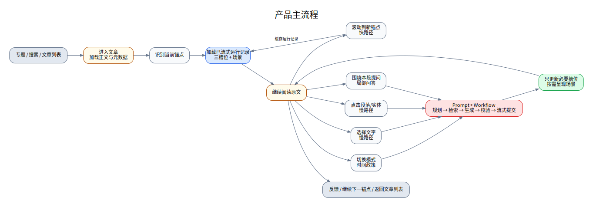
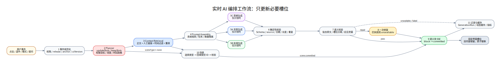
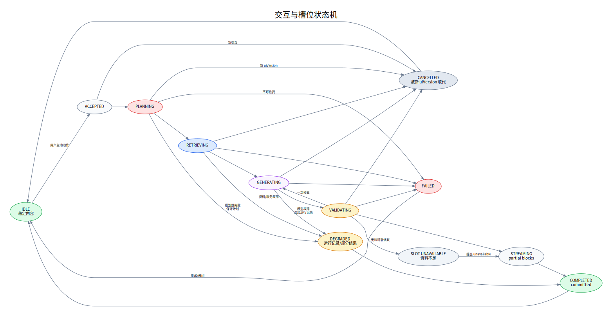
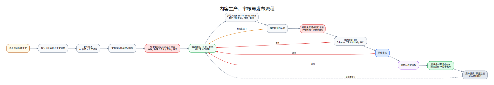

# 03. 产品流程、交互流程与状态机

## 3.1 总体产品流程



```text
进入专题/文章
  → 加载正文与文章元数据
  → 识别首个可见锚点
  → 加载已流式运行记录
  → 用户继续阅读
      ├─ 滚动：切换锚点运行记录
      ├─ 点击实体：定向深挖
      ├─ 选中文字：局部推理分析
      ├─ 切换模式：应用时间策略
      ├─ 打开场景：可视化探索
      └─ 提问：当前文章范围问答
  → 反馈/收藏/继续下一锚点
```

## 3.2 快路径：锚点切换

### 触发条件

- 当前可见锚点与客户端状态不同；
- 锚点稳定超过 450ms；
- 页面不处于“锁定当前卡片”状态。

### 流程

1. 前端生成 `anchor_changed` 事件；
2. BFF 查询流式运行记录；
3. 生成运行服务按完整版本键读取缓存；
4. 返回三槽位与场景；
5. 前端基于内容哈希只更新变化部分；
6. 后端异步预取相邻锚点；
7. 若运行记录缺失，保留旧卡并入队生成，不阻塞阅读。

### 运行记录键

```text
articleVersion
+ anchorId
+ readingMode
+ contextPackVersion
+ promptVersion
+ workflowVersion
```

## 3.3 慢路径：主动深挖



### 支持事件

- `paragraph_clicked`
- `text_selected`
- `entity_clicked`
- `mode_changed`
- `question_submitted`

### 流程

1. **事件规范化**：验证文章、锚点、选区、实体和客户端版本；
2. **规划**：决定范围、更新槽位、检索类型、场景和时间策略；
3. **检索**：获取正文上下文、ContextUnit、来源与实体数据；
4. **提示输入组装**：将用户文本作为数据区，不得当作系统指令；
5. **并行生成**：只生成规划器要求更新的槽位；
6. **确定性校验**：Schema、长度、来源、日期、重复、枚举；
7. **模型校验**：检查语义边界、时间泄漏、是否贴合原文；
8. **一次修复**：按修订指令重新生成失败字段；
9. **流式提交**：语义块 → 完整卡片 → 场景；
10. **保存运行记录**：输入哈希、来源、版本、耗时、成本、结果；
11. **缓存**：相同事件短期复用。

## 3.4 文章首次进入状态机

```text
UNLOADED
  → ARTICLE_LOADING
  → TEXT_READY
  → STREAM_PREPARING
  → READY

异常：
ARTICLE_LOADING → ARTICLE_ERROR
STREAM_PREPARING → READY_WITHOUT_CONTEXT
```

`READY_WITHOUT_CONTEXT` 仍允许阅读正文，并显示“此锚点的情境内容正在准备”。

## 3.5 交互状态机



```text
IDLE
  → ACCEPTED
  → PLANNING
  → RETRIEVING
  → GENERATING
  → VALIDATING
  → STREAMING
  → COMPLETED

任何执行态：
  → FAILED（可重试）
  → CANCELLED（被更新交互取代）
```

同一会话内，新的选区事件可以取消旧的未提交生成。已经 `slot.committed` 的卡片保留，除非新事件明确更新该槽位。

## 3.6 模式切换流程

### 平衡阅读 → 回到当时

- 设置 `timePolicy=freeze_at_article_date`；
- 检索层排除文章日期之后的 `outcome` 和事件；
- 处境卡必须重算；
- 背景卡如包含后续信息则重算；
- 思想卡仅在存在结果倒推语言时重算；
- 场景过滤后续节点。

### 回到当时 → 前因后果

- 保留当时处境卡；
- 在可展开区增加“后来发生了什么”；
- 场景可增加后续节点，但必须视觉区分；
- 不得把结果写回“当时已知信息”。

## 3.7 选中文本流程

1. 用户选中 5–500 个字符；
2. 前端附带前后各 1–2 段上下文；
3. 规划器默认 `scope=selection`；
4. 背景通常保持；
5. 处境只在选区涉及限制、对象或争论时更新；
6. 思想卡必须更新；
7. 若选区表达选择或策略，优先考虑决策路径；
8. 结果以“针对所选文字”标记，退出选区后可恢复锚点运行记录。

## 3.8 实体点击流程

### 人物/组织

- 显示其在文章写作时点的身份、位置、目标和与当前问题的关系；
- 不展示无关生平；
- 可能更新处境卡和关系图。

### 地点

- 显示该地点对当前论证的空间意义；
- 地图坐标必须来自已整理数据；
- 可能更新背景或处境卡。

### 事件

- 显示事件在前置链条中的位置；
- 可打开局部时间线；
- 不自动扩展到完整事件百科。

### 概念

- 解释该概念在本文当前段落中的具体用法；
- 默认不跨文章；
- P1 才允许切换到思想脉络。

## 3.9 局部问答流程

问题首先分类：

1. 当前选区可回答；
2. 当前锚点可回答；
3. 当前全文可回答；
4. 需要馆内其他文章；
5. 超出系统资料范围。

前 3 类直接处理；第 4 类在 P1 提供跨文检索；第 5 类应说明边界并建议收窄问题。

回答结构：

```text
直接回答
为什么这样理解
对应原文锚点
使用的背景资料
不确定或争议点（如有）
```

问答答案可以触发“把这部分更新到处境卡/思想卡”，但必须经过槽位工作流重新生成，而不是直接复制聊天文本。

## 3.10 内容生产流程



```text
导入正文
→ 校对与段落 ID
→ 划分锚点
→ AI 提取候选实体/事件/约束/争论
→ 编辑确认与补充
→ 登记来源
→ 关联 ContextUnit 与锚点
→ 生成默认运行记录
→ 自动质量检查
→ 历史审核
→ 思想内容审核
→ 发布与缓存预热
```

任何 AI 候选默认状态为 `machine_candidate`，不能被发布流程直接视为已审核事实。

## 3.11 发布与回滚

发布必须创建不可变发布对象：

- articleVersion；
- contextPackVersion；
- promptVersion；
- workflowVersion；
- generationRunSetVersion；
- publishedAt；
- publisherId。

回滚只切换当前发布指针，不删除历史版本。新发布的运行记录应先预热缓存，再原子切换。

## 3.12 异常与降级路径

| 异常 | 用户侧行为 | 系统侧行为 |
|---|---|---|
| 运行记录不存在 | 保留上一个卡片，显示准备中 | 异步生成并创建编辑任务 |
| 规划器超时 | 使用保守默认计划 | 更新处境和思想，场景为 none |
| 单槽位生成失败 | 其他槽位正常提交 | 失败槽位显示 unavailable |
| 校验失败 | 不提交错误块 | 最多一次修复，仍失败则降级 |
| 模型整体不可用 | 正文和运行记录正常 | 暂停实时深挖并记录告警 |
| SSE 断开 | 可自动重连 | 支持 Last-Event-ID 或轮询最终结果 |
| 新交互到达 | 旧加载状态取消 | 设置 cancelled，禁止旧流覆盖 |
| ContextPack 资料不足 | 明确说明不足 | 创建内容缺口任务 |
