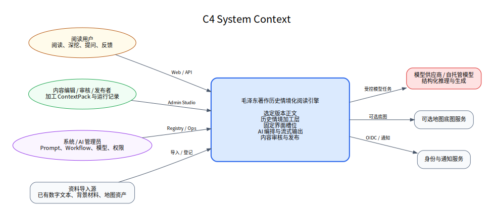

# 04. 系统架构详细设计

## 4.1 架构上下文



外部参与者：

- 阅读用户；
- 内容编辑与审核者；
- 管理员；
- 模型供应商或自托管模型；
- 可选地图底图服务；
- 可选馆藏或资料导入源。

系统对外提供阅读页、内容工作台和受控 API；对内维护正文、ContextPack、Prompt、Workflow、流式运行记录和运行审计。

## 4.2 推荐实现形态

第一阶段采用“模块化单体 + 独立异步 Worker”：

```text
web-app
admin-studio
api-app
  ├── article module
  ├── context module
  ├── reading module
  ├── generation_run module
  ├── orchestration module
  ├── registry module
  └── audit module
ai-worker
content-worker
postgres
redis
object-store
```

这样可减少运维复杂度，同时保留清晰边界。只有当模型吞吐、内容生产任务或公开 API 独立扩展时再拆分服务。

## 4.3 客户端架构

### 阅读端状态

```text
releaseState
articleState
readerPositionState
uiSlotState
sceneState
interactionState
streamState
userPreferenceState
```

关键规则：

- `releaseId` 进入页面后固定；
- `anchorId` 由 IntersectionObserver 与稳定算法计算；
- `uiVersion` 每次新交互递增；
- SSE 事件必须携带 `uiVersion`；
- 前端只接受等于当前版本的事件；
- 已流式运行记录与动态覆盖层分开保存，以便退出选区后恢复。

### 客户端数据层

- 文章正文长缓存；
- 当前锚点及相邻运行记录预取；
- SSE 重连和事件去重；
- 场景组件按类型懒加载；
- 动态结果仅在会话内保留，必要时向服务端查询已保存运行。

## 4.4 API/BFF

职责：

- 会话与身份；
- 聚合文章、运行记录和用户状态；
- 生成幂等键；
- 建立 SSE；
- 过滤和裁剪客户端可见字段；
- 限流与配额；
- 跟踪 `requestId`、`sessionId`、`interactionId` 和 `releaseId`。

BFF 不执行历史语义判断，只做协议与状态协调。

## 4.5 文章服务

核心接口：

- 获取文章列表与筛选；
- 获取文章元数据、段落和锚点；
- 按锚点获取前后文；
- 获取选定版本说明；
- 管理文章版本与发布引用。

正文段落 ID 一旦发布不得复用。删除段落应标记归档并建立替代关系，避免旧分享链接失效。

## 4.6 Context 服务

### 核心职责

- 保存 ContextPack 与 ContextUnit；
- 管理单位类型、时间范围、来源和审核状态；
- 建立 Unit 到 Anchor 的链接；
- 管理实体与地点；
- 按检索条件返回可用情境材料；
- 执行资料可见性和时间过滤。

### 检索接口输入

```json
{
  "releaseId": "rel_demo",
  "articleId": "article_demo",
  "anchorId": "anchor_03",
  "scope": "selection",
  "selection": "...",
  "targets": ["constraint", "debate", "concept"],
  "timePolicy": "freeze_at_article_date",
  "limitPerType": 6
}
```

### 排序信号

- 人工链接相关度；
- 与当前锚点角色；
- 时间关系；
- 精确实体匹配；
- 关键词匹配；
- 语义相似度；
- 来源等级；
- 是否已经在当前卡片使用；
- 多样性惩罚，避免同类重复。

人工链接相关度高于纯向量召回。

## 4.7 AI Orchestrator


### 节点

1. `normalize_interaction`
2. `resolve_release_and_anchor`
3. `plan_update`
4. `retrieve_context`
5. `assemble_prompt_inputs`
6. `generate_slots_parallel`
7. `validate_deterministic`
8. `validate_semantic`
9. `repair_once_if_needed`
10. `stream_commits`
11. `generate_scene_if_needed`
12. `persist_run`
13. `cache_result`

### 编排状态

每个节点记录：开始时间、结束时间、输入摘要、输出摘要、异常和重试。长任务使用任务 ID，并可从任意已完成节点恢复。

### 并发策略

- 背景、处境、思想可并行；
- 场景依赖 Planner 和已检索数据，可与卡片生成并行，但必须在卡片之后提交；
- Validator 可对每卡独立运行；
- 同一交互最多一次修复；
- 用户新交互到达时，未开始的节点取消，正在调用的模型可标记结果丢弃。

## 4.8 Prompt Registry

每个 Prompt 记录：

```text
promptKey
version
role
purpose
inputVariables
outputSchema
modelPolicy
temperaturePolicy
maxOutputPolicy
text
testSuiteId
status: draft/reviewed/published/deprecated
```

Prompt 发布必须运行 Golden Set。运行时只使用 `published` 版本，并与 release 绑定。

## 4.9 Workflow Registry

工作流采用声明式 YAML，记录：

- 触发事件；
- 节点顺序和并行组；
- 条件分支；
- 输入输出 Schema；
- 超时、重试和回退；
- 质量门禁；
- 缓存策略；
- 可观察字段。

业务代码实现节点执行器，工作流文件控制组合，减少把 Prompt 流程硬编码在控制器中。

## 4.10 Model Gateway

统一请求：

```json
{
  "task": "generate_situation_card",
  "modelPolicy": "balanced_reasoning",
  "messages": [],
  "responseSchema": "ui-card.schema.json",
  "timeoutMs": 12000,
  "trace": {
    "interactionId": "int_...",
    "promptVersion": "situation@1.1"
  }
}
```

网关负责：

- 供应商适配；
- 结构化输出；
- 超时与熔断；
- 有限重试；
- 模型路由；
- Token、成本和延迟记录；
- 敏感日志脱敏；
- 请求与结果哈希。

网关不负责业务检索和 Prompt 选择。

## 4.11 Validator

### 确定性校验

- JSON Schema；
- sourceIds 存在且可见；
- 日期未超过截止时间；
- 具体坐标/数字是否来自结构化字段；
- 长度与条目数；
- updateSlots / keepSlots 不冲突；
- 场景节点上限；
- 卡片之间近似重复；
- 禁用词和意外 HTML。

### 语义校验

- 是否贴合当前原文；
- 是否混淆背景、处境、思想；
- 是否用后来结果倒推；
- 是否把解释写成事实；
- 是否空泛、口号化；
- 是否遗漏主要限制或问题；
- 是否应该 `unavailable`。

语义校验可用专门模型或同模型不同 Prompt。流式运行记录必须人工复核，实时结果可依质量等级决定是否启用模型校验。

## 4.12 Generation Runtime

运行记录类型：

- `default`：锚点默认平衡阅读；
- `time_frozen`：回到当时；
- `aftereffects`：前因后果；
- `locked_editorial`：编辑人工锁定，不随 Prompt 重生成。

生成流程：

```text
ContextPack 发布候选
→ 遍历锚点与模式
→ 批量生成
→ 自动校验
→ 人工抽查/全审
→ 创建 GenerationRunSet
→ 缓存预热
→ 原子发布
```

运行记录内容不可原地修改，修订产生新版本。

## 4.13 Scene Service

模型只返回声明式结构。Scene Service：

- 验证 ID、日期、坐标和关系；
- 解析 ContextUnit 与实体；
- 生成前端通用 payload；
- 添加文本等价摘要；
- 限制节点、边和标签；
- 对地图进行边界框与聚合；
- 对时间线排序；
- 对决策图检测环路。

## 4.14 内容工作台服务

主要模块：

- 导入与正文检查；
- 段落与锚点编辑；
- ContextUnit 编辑；
- 来源登记；
- AI 候选提取；
- Unit—Anchor 关联；
- 场景数据编辑；
- Prompt 预览；
- 运行记录生成与对比；
- 质量报告；
- 审核、发布和回滚。

## 4.15 数据存储策略

| 数据 | 主存储 | 缓存/索引 |
|---|---|---|
| 正文、锚点 | PostgreSQL | Redis/客户端缓存 |
| ContextUnit、链接 | PostgreSQL | pgvector/全文索引 |
| 地点、路线 | PostgreSQL + PostGIS | 矢量切片或客户端缓存 |
| 流式运行记录 | PostgreSQL JSONB | Redis |
| Prompt/Workflow | PostgreSQL 或 Git 同步 | 进程内缓存 |
| 运行记录 | PostgreSQL 分区表 | 日志/追踪系统 |
| 导入文件/资产 | 对象存储 | CDN |
| 分析事件 | 事件存储或分析库 | 聚合报表 |

## 4.16 数据版本与可重放

`GenerationRun` 必须保存：

- releaseId；
- interaction event；
- normalized input hash；
- retrieved context unit IDs；
- source IDs；
- prompt bundle version；
- workflow version；
- model key 与参数；
- candidate output；
- validation report；
- final output；
- timings 与 cost；
- parentRunId（修复或重试）。

出于成本和隐私，可只保存必要文本摘要或加密原始输入，但重放所需的版本和来源 ID 必须保留。

## 4.17 可观测性

每次交互统一 Trace：

```text
requestId
sessionId
interactionId
releaseId
articleId
anchorId
uiVersion
workflowVersion
promptBundleVersion
modelKey
```

核心指标：

- generation run stream started；
- planner latency；
- retrieval latency；
- model latency by task；
- validator failure；
- repair rate；
- slot unavailable rate；
- time leakage rate；
- source coverage；
- SSE disconnect；
- cost per interaction。

## 4.18 扩展策略

### 当文章规模扩大

- 文章和 ContextUnit 表按馆藏或时间分区；
- 运行记录采用对象化缓存；
- 全文检索迁移专用搜索集群；
- 离线生成 Worker 独立扩缩；
- 历史情境跨文章复用采用全局 Unit + 文章链接。

### 当实时访问扩大

- BFF 与 API 横向扩展；
- SSE 连接使用专门网关或支持长连接的负载均衡；
- AI Worker 按模型并发和配额扩缩；
- 热门交互结果进入动态缓存；
- 优先返回已流式运行记录，再异步增强。

### 当进入研究级能力

- 增加原始影像和版本层；
- 引入可引用永久标识；
- 增加图谱投影和 SPARQL/GraphQL；
- 增加资料导出与研究路径保存；
- 保持现有 Article/Anchor/ContextPack 协议向后兼容。

