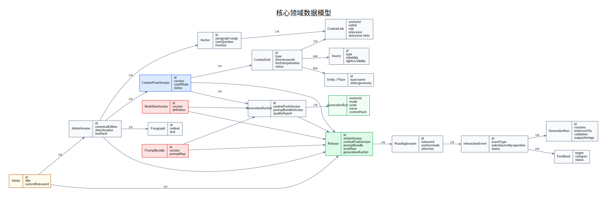

# 07. 数据模型与存储设计

## 7.1 领域模型



```text
Collection
  └─ Article
      └─ ArticleVersion
          ├─ Paragraph
          ├─ Anchor
          └─ ContextPack
              ├─ ContextUnit
              ├─ Entity / Place
              ├─ Source
              └─ ContextLink

Release
  ├─ ArticleVersion
  ├─ ContextPackVersion
  ├─ PromptBundleVersion
  ├─ WorkflowVersion
  └─ GenerationRunSet

ReadingSession
  ├─ InteractionEvent
  ├─ GenerationRun
  └─ Feedback
```

## 7.2 设计原则

- 发布版本不可变；
- 可编辑对象与发布对象分离；
- 正文段落 ID 稳定；
- 关系数据显式建表，灵活内容放 JSONB；
- 每条事实材料都可关联 Source；
- AI 运行记录与规范内容分离；
- PostgreSQL 是权威源，缓存和向量索引可重建；
- 单一选定版本不等于不做版本字段：仍需记录本项目采用哪个版本和何时导入。

## 7.3 核心表

### `collections`

专题或馆藏集合。

| 字段 | 类型 | 说明 |
|---|---|---|
| id | uuid/text | 主键 |
| slug | text unique | URL 标识 |
| title | text | 名称 |
| description | text | 简介 |
| status | enum | draft/published/archived |

### `articles`

文章逻辑实体。

| 字段 | 说明 |
|---|---|
| id | 稳定文章 ID |
| collection_id | 所属集合 |
| slug | URL 标识 |
| title | 标题 |
| default_version_id | 当前编辑默认版本 |
| current_release_id | 当前公共发布 |
| status | 状态 |

### `article_versions`

选定版本正文的不可变版本。

| 字段 | 说明 |
|---|---|
| id | 版本 ID |
| article_id | 文章 |
| version_label | 选定版本说明 |
| imported_from | 导入来源 |
| article_date | 写作日期 |
| date_precision | day/month/year/range/unknown |
| location_text | 写作地点 |
| document_type | 文体 |
| audience | 主要对象 |
| purpose | 写作目的 |
| core_question | 文章级核心问题 |
| text_hash | 正文哈希 |
| created_by | 导入者 |
| created_at | 时间 |

### `paragraphs`

| 字段 | 说明 |
|---|---|
| id | 稳定段落 ID |
| article_version_id | 所属版本 |
| ordinal | 顺序 |
| text | 正文 |
| text_hash | 段落哈希 |
| entity_spans | 可选 JSONB 标记 |

唯一约束：`article_version_id + ordinal`。

### `anchors`

| 字段 | 说明 |
|---|---|
| id | 锚点 ID |
| article_version_id | 版本 |
| title | 锚点名 |
| start_ordinal/end_ordinal | 段落范围 |
| function_in_article | 论证作用 |
| core_question | 锚点问题 |
| summary | 编辑摘要 |
| scene_preference | none/timeline/decision/map/relations |

发布前必须验证锚点覆盖全文、不重叠、不缺段。

### `context_packs`

逻辑包，允许多个版本。

| 字段 | 说明 |
|---|---|
| id | 逻辑包 ID |
| article_version_id | 对应正文版本 |
| current_version_id | 当前编辑版本 |
| status | 状态 |

### `context_pack_versions`

| 字段 | 说明 |
|---|---|
| id | 版本 ID |
| context_pack_id | 逻辑包 |
| version | 语义版本 |
| cutoff_date | 时间冻结截止 |
| summary | 包说明 |
| status | draft/review/published/archived |
| content_hash | 完整内容哈希 |
| created_by/created_at | 审计 |

### `context_units`

| 字段 | 说明 |
|---|---|
| id | Unit ID |
| context_pack_version_id | 所属包版本 |
| type | event/actor_state/... |
| title | 标题 |
| summary | 简述 |
| details | 详细说明 |
| valid_from/valid_to | 事实有效时间 |
| known_at | 当时可知时间 |
| time_relation | before/at/after/long_term |
| fact_interpretation | fact/interpretation/inference/question |
| confidence | high/medium/low |
| source_ids | 可使用关联表或数组 |
| entity_ids/place_ids | 关联 |
| editorial_status | machine_candidate/draft/approved/rejected |
| visibility | private/internal/public |
| structured_data | JSONB，类型特有字段 |
| embedding | 可选 vector |

### `context_links`

| 字段 | 说明 |
|---|---|
| anchor_id | 锚点 |
| context_unit_id | Unit |
| role | precondition/trigger/... |
| relevance | 0–1 |
| priority | 整数 |
| slot_hints | text[] |
| scene_hints | text[] |
| editor_note | 备注 |

唯一约束：`anchor_id + context_unit_id + role`。

### `entities`

人物、组织、概念等统一实体。

| 字段 | 说明 |
|---|---|
| id | 实体 ID |
| type | person/organization/concept/event_group |
| canonical_name | 规范名 |
| aliases | 别名数组 |
| description | 只保留馆内需要的信息 |
| visibility | 可见性 |

### `places`

| 字段 | 说明 |
|---|---|
| id | 地点 ID |
| name | 名称 |
| aliases | 别名 |
| geom | PostGIS geometry |
| precision | exact/approximate/region/unknown |
| description | 与文章相关的空间说明 |

### `sources`

| 字段 | 说明 |
|---|---|
| id | 来源 ID |
| title | 标题 |
| source_type | canonical_text/archive/book/article/... |
| creator | 作者/机构 |
| publication_date | 时间 |
| locator | 页码/章节/条目 |
| reliability | A/B/C/D |
| rights_status | public/internal/restricted/unknown |
| citation_text | 简短引用格式 |
| notes | 编辑说明 |

### `generation_runs`

| 字段 | 说明 |
|---|---|
| id | 运行记录 ID |
| generation_run_set_id | 发布批次 |
| anchor_id | 锚点 |
| mode | balanced/time_frozen/aftereffects |
| cards | JSONB |
| scene | JSONB |
| source_ids | text[] |
| content_hash | 哈希 |
| quality_report | JSONB |
| locked | 是否人工锁定 |

### `releases`

| 字段 | 说明 |
|---|---|
| id | releaseId |
| article_id | 文章 |
| article_version_id | 正文版本 |
| context_pack_version_id | 情境包版本 |
| prompt_bundle_version | Prompt 组合 |
| workflow_version | 工作流 |
| generation_run_set_id | 运行记录批次 |
| published_by/at | 发布审计 |
| status | active/superseded/rolled_back |

### `reading_sessions`

记录用户或匿名会话、release、当前锚点与模式。匿名会话可用短期 ID，不必收集个人身份。

### `interaction_events`

保存标准化用户事件与幂等键。敏感问题文本可按保留策略脱敏或加密。

### `generation_runs`

保存编排运行、检索、模型、版本、校验、耗时和输出。大文本可拆到对象存储或按周期归档。

### `feedback`

关联 session、interaction、slot、generation_run/run 与问题类型。

### `prompt_versions` / `workflow_versions`

保存发布状态、内容哈希、测试结果和 Git commit。

### `audit_logs`

内容编辑、审核、发布、回滚、权限和 Prompt 变更的不可变审计记录。

## 7.4 JSONB 与关系字段边界

使用关系字段：

- ID、状态、版本、时间、权限；
- Article—Paragraph—Anchor；
- Unit—Anchor；
- Source、Entity、Place 关联；
- 发布与审核关系。

使用 JSONB：

- 类型特有的 ContextUnit 结构；
- Card/Scene payload；
- Validation report；
- Generation trace 摘要；
- 前端 entity spans。

不要把所有内容塞进一个 ContextPack JSON，否则难以审核、检索、增量发布和引用。

## 7.5 索引

建议：

```sql
CREATE INDEX ON paragraphs(article_version_id, ordinal);
CREATE INDEX ON anchors(article_version_id, start_ordinal, end_ordinal);
CREATE INDEX ON context_units(context_pack_version_id, type, editorial_status);
CREATE INDEX ON context_units(known_at);
CREATE INDEX ON context_links(anchor_id, relevance DESC);
CREATE INDEX ON generation_runs(generation_run_set_id, anchor_id, mode);
CREATE INDEX ON interaction_events(session_id, created_at DESC);
CREATE INDEX ON generation_runs(interaction_id);
CREATE INDEX ON feedback(status, created_at DESC);
```

正文全文索引和 `context_units` 的 `tsvector` 可在数据量增长后增加。向量索引只用于召回，不替代人工链接。

## 7.6 分区与归档

高增长表：

- `interaction_events`
- `generation_runs`
- `analytics_events`
- `audit_logs`

可按月分区。运行详情超过保留期后可归档到对象存储，只在 PostgreSQL 保留索引、哈希和质量摘要。

## 7.7 删除与更正

- 发布版本不物理删除，使用 `archived`；
- 权利要求删除时，将内容设为不可见并保留最小审计；
- Source 更正产生新记录或修订版本；
- ContextUnit 修订产生新 ContextPack 版本；
- 段落修订产生新 ArticleVersion；
- 已分享 URL 通过旧 release 继续访问或显示“该版本已归档”。

## 7.8 数据迁移

每个 Schema 变更需要：

- SQL migration；
- JSON Schema 版本；
- API 兼容策略；
- 示例数据迁移；
- Prompt 输入适配；
- 回滚脚本；
- 发布说明。

数据库脚本见 `database/`，JSON 契约见 `specs/json-schema/`。

