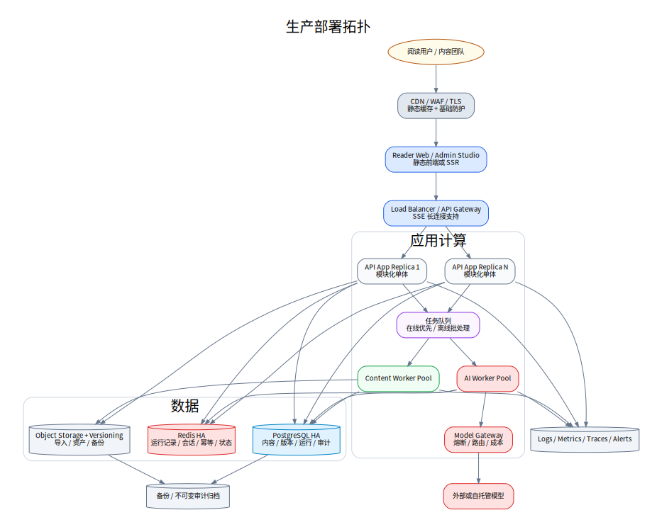

# 13. 部署、运维与可观测性

## 13.1 环境

- `local`：开发者本机，必须配置真实大模型或明确失败；
- `dev`：团队联调，允许快速 Prompt 试验；
- `staging`：与生产同构，使用发布候选数据；
- `production`：仅使用 published Prompt/Workflow/Release；
- 可选 `research`：内部受限资料与自托管模型环境。

不同环境数据库、对象存储、密钥和模型项目完全隔离。

## 13.2 部署拓扑



```text
CDN / WAF
  ├─ Reading Web
  └─ Admin Studio
        ↓
Load Balancer / API Gateway
        ↓
API App replicas
  ├─ Reading/Content/GenerationRun modules
  ├─ SSE endpoint
  └─ Orchestration submitter
        ↓
Async Queue
  ├─ AI Workers
  └─ Content Workers
        ↓
PostgreSQL + Redis + Object Storage
        ↓
Model Gateway / Observability / Audit Archive
```

## 13.3 Docker Compose 与生产

本包提供开发用 Compose。生产建议：

- 应用容器无状态；
- SSE 负载均衡支持长连接与适当超时；
- Worker 独立扩缩；
- PostgreSQL 主从或托管高可用；
- Redis 高可用；
- 对象存储启用版本和生命周期；
- 密钥由专用服务管理；
- 模型网关有熔断和配额；
- CDN 缓存公开正文与静态资源，不缓存用户交互。

首期不强制 Kubernetes；团队熟悉的容器平台即可。可恢复、可观测和可回滚比服务数量更重要。

## 13.4 CI/CD

### Pull Request

```text
lint
→ unit tests
→ schema validation
→ API contract
→ SQL migration check
→ diagram source check
→ starter smoke
→ security scan
```

### Prompt/Workflow 变更

```text
parse YAML
→ schema check
→ golden set
→ regression report
→ human approval
→ publish registry version
```

### Release

```text
build immutable image
→ deploy staging
→ migrate dry run
→ smoke/E2E
→ content release validation
→ production canary
→ health check
→ full rollout
→ rollback ready
```

## 13.5 数据库迁移

- 使用单向编号 migration；
- 先兼容代码、后迁移数据、再删除旧字段；
- 大表采用在线变更；
- 迁移前自动备份；
- 每个 migration 有验证与回滚计划；
- 流式运行记录和旧 release 在迁移后必须可读。

## 13.6 备份与恢复

建议目标：

- PostgreSQL：每日全备 + 持续日志；
- 对象存储：版本化和跨区域副本；
- Prompt/Workflow/Schema：Git + registry DB；
- Redis：可丢失，不作为唯一真相；
- Release 指针：定期导出；
- 审计日志：不可变归档。

恢复演练至少每季度一次。恢复优先级：正文与流式运行记录 → ContextPack → Prompt/Workflow → 运行记录与分析。

## 13.7 日志

结构化字段：

```text
timestamp
level
service
requestId
sessionId
interactionId
releaseId
articleId
anchorId
workflowNode
modelPolicy
promptVersion
status
latencyMs
errorCode
```

不在普通日志写入完整用户问题、受限正文或密钥。需要调试的原始输入进入受控加密存储并设短保留期。

## 13.8 指标

### 产品服务

- article_load_latency；
- generation_run_latency；
- generation_run_stream_started；
- active_sse_connections；
- interaction_rate；
- feedback_rate。

### AI

- planner_latency；
- retrieval_latency；
- model_latency_by_task；
- token/cost_by_task；
- validation_fail；
- repair_rate；
- unavailable_rate；
- source_coverage；
- time_leakage_detected。

### 内容生产

- article_processing_cycle_time；
- units_per_article；
- review_rejection_rate；
- generation_run_success；
- unresolved_gaps；
- feedback_to_fix_time。

## 13.9 Trace

每次慢路径为一条分布式 Trace：

```text
HTTP accept
→ plan
→ retrieve
→ generate background/situation/thought
→ validate
→ repair
→ scene
→ stream
→ persist
```

模型调用需作为 span，记录模型策略、输入/输出 Token、超时和供应商请求 ID，不记录敏感原文全文。

## 13.10 告警

### P0

- 当前公开 Release 无法读取；
- 正文或运行记录数据损坏；
- 权利受限内容公开；
- 管理端越权；
- 发布指针异常。

### P1

- 模型整体不可用超过阈值；
- 动态交互失败率大幅上升；
- Validator fail 异常；
- SSE 中断率异常；
- PostgreSQL 复制/备份失败；
- 费用异常增长。

### P2

- 某 Prompt unavailable 上升；
- 某锚点反馈异常；
- 缓存命中下降；
- 场景渲染错误上升。

## 13.11 模型故障策略

```text
primary model timeout
→ one bounded retry or alternate endpoint
→ fallback model if allowed
→ if still fail, emit interaction.failed
→ open circuit when threshold reached
```

模型故障不能影响正文阅读；系统不得用静态答案或伪生成内容冒充实时大模型输出。

## 13.12 容量规划

关注四类容量：

- 公开正文和运行记录读流量；
- SSE 长连接；
- 动态模型并发；
- 离线运行记录批处理。

离线任务与在线交互使用不同队列和优先级。在线处境卡优先于批量生成；批处理可暂停或限速。

## 13.13 成本治理

- 每个模型策略配置单次 Token 上限；
- 每个交互限制模型调用数；
- 发布前估算整篇运行记录成本；
- 提供文章、任务和模型维度成本报表；
- 预算接近阈值时先停离线低优任务；
- 通过运行记录、最小更新、缓存和上下文裁剪降低成本；
- 不以降低历史质量为代价自动切换廉价模型。
